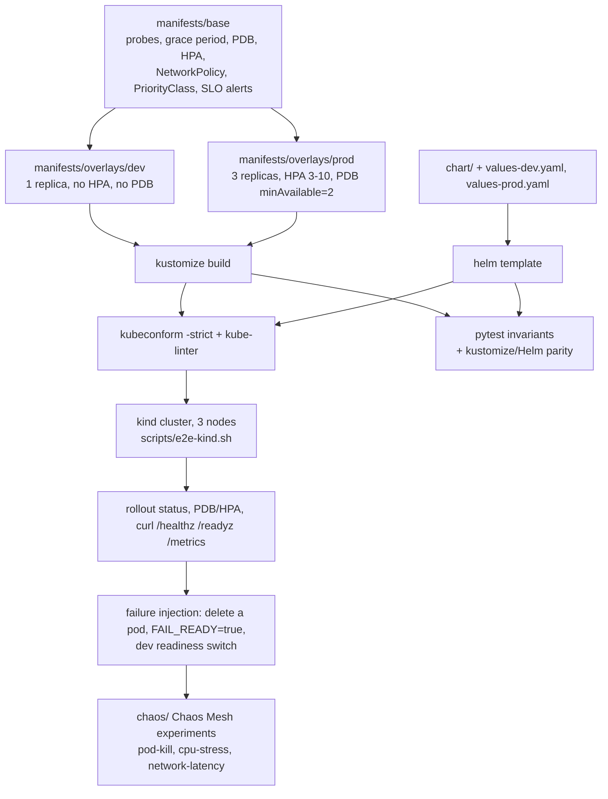

# k8s-sre-lab

A single-service Kubernetes deployment that carries the reliability work in the manifests: probes with a start window, graceful shutdown, a disruption budget, autoscaling, soft spreading, a default-deny network policy and SLO burn-rate alerts — validated by schema/policy gates and by a real kind E2E in CI.

[](https://github.com/dayxus/k8s-sre-lab/actions/workflows/ci.yml)
[](LICENSE)
[](pyproject.toml)
[](tools/versions.env)

## What it does

- Runs a dependency-free demo API (`app/server.py`, Python stdlib) that answers `/healthz`, `/readyz` and `/metrics` in Prometheus text format, and drains in-flight requests on `SIGTERM`.
- Ships the same reliability contract twice: as a kustomize base plus `dev` and `prod` overlays, and as an equivalent Helm chart (`chart/`) with `values-dev.yaml` / `values-prod.yaml`.
- Asserts the contract in 160 pytest tests: every container has startup, readiness and liveness probes with cpu/memory requests and limits, `terminationGracePeriodSeconds: 45` with a `preStop` sleep that fits inside it, `maxUnavailable: 0`, a PodDisruptionBudget for every multi-replica workload, non-root security contexts, fixed image tags, and no `hostPath`/`privileged`/`cluster-admin`.
- Compares the two delivery paths field by field (`tests/test_chart.py`): if `helm template` drifts from the overlay on a reliability-bearing field, the suite fails.
- Runs kubeconform (`-strict`, against the pinned Kubernetes version) and kube-linter in `scripts/validate.sh`, and proves the rendered prod overlay on a 3-node kind cluster in the `e2e-kind` CI job.
- Records three Chaos Mesh experiments (pod kill, CPU stress, network latency) with hypothesis, signal, success criterion and rollback in `chaos/`.

## Why it matters for SRE

The interesting part of a deploy is not that it starts, it is what happens during the minute it is rolling, the second a node drains, and the moment a dependency gets slow. Probes decide which pods receive traffic, `preStop` plus the grace period decide whether a restarted pod drops a request, the PDB and `maxUnavailable: 0` decide whether a drain and a rollout can remove capacity at the same time, and the burn-rate rules decide whether a slow degradation is noticed before the error budget is gone. This repo turns each of those decisions into a file that a reviewer can read and a test that fails when it regresses — the same things an SRE reviews in a runbook, minus the prose.

## The reliability contract

| Reliability pattern | Problem it prevents | Where it lives |
| --- | --- | --- |
| `startupProbe` on `/healthz` (15 × 2s) | A slow start being read as a hang, restarting the pod in a loop | `manifests/base/deployment.yaml` |
| `readinessProbe` on `/readyz` (5s period) | Traffic being sent to a pod that is still warming up | `manifests/base/deployment.yaml` |
| `livenessProbe` on `/healthz` (10s period) | A wedged process holding its endpoint forever | `manifests/base/deployment.yaml` |
| `preStop` sleep + `terminationGracePeriodSeconds: 45` | `SIGTERM` arriving before the endpoint is removed, so clients see resets | `manifests/base/deployment.yaml` |
| `strategy.rollingUpdate.maxUnavailable: 0` | A rollout that removes capacity before the replacement is Ready | `manifests/base/deployment.yaml` |
| `PodDisruptionBudget` `minAvailable: 2` + `unhealthyPodEvictionPolicy: AlwaysAllow` | A node drain evicting the whole service, or a drain blocked forever by a broken pod | `manifests/base/pdb.yaml`, `manifests/overlays/prod/patch-pdb.yaml` |
| HPA 3 → 10, `scaleDown.stabilizationWindowSeconds: 600`, explicit policies | Flapping replicas on a short spike | `manifests/base/hpa.yaml` |
| Soft `topologySpreadConstraints` + *preferred* pod anti-affinity | Every replica landing on one node; or pods stuck `Pending` when the cluster has fewer nodes than replicas | `manifests/base/topology-spread.yaml` |
| Default-deny `NetworkPolicy` with DNS egress allowed | Lateral movement out of a compromised pod | `manifests/base/networkpolicy.yaml` |
| `PriorityClass` `k8s-sre-lab-critical` | The API being evicted first under node pressure | `manifests/base/priorityclass.yaml` |
| `PrometheusRule`: fast/slow burn rate + no-ready-endpoints, crash-loop, stuck-rollout | Silent degradation and a rollout that never finishes | `manifests/base/prometheusrule.yaml` |
| Non-root pod, `readOnlyRootFilesystem`, dropped capabilities, `RuntimeDefault` seccomp | A container that turns a bug into a node-level incident | `manifests/base/deployment.yaml`, `chart/values.yaml` |

## Architecture



## Quickstart

```bash
git clone https://github.com/dayxus/k8s-sre-lab
cd k8s-sre-lab

# Python suite + the pinned validation binaries (kustomize, kubeconform, kube-linter, helm into .tools/)
make setup
make test        # 160 tests: manifest invariants, chart parity, app behaviour, repo hygiene
make validate    # kustomize build + helm lint/template + kubeconform + kube-linter
make check       # lint + test + validate, the full local gate

# Render every shape without any tooling on PATH
python3 scripts/render.py --out build

# The cluster path (needs docker, kind and kubectl; it is what the CI job e2e-kind runs)
make e2e
```

## Verify it yourself

The rendered prod overlay is the object that ends up in the cluster, so the checks start there:

```console
$ .tools/kustomize build manifests/overlays/prod | grep -E 'maxUnavailable|maxSurge|minAvailable|terminationGracePeriodSeconds'
      maxSurge: 1
      maxUnavailable: 0
      terminationGracePeriodSeconds: 45
  minAvailable: 2

$ .tools/kube-linter lint --config .kube-linter.yaml build/kustomize-prod.yaml build/helm-prod.yaml
KubeLinter 0.8.3

No lint errors found!
```

`make check` runs the same gate on both delivery paths: `kubeconform -strict` against the
pinned Kubernetes version needs to download its schemas, and the kind E2E needs a container
runtime — neither exists on the machine this repo was authored on, which is why the
authoritative run of `scripts/e2e-kind.sh` is the `e2e-kind` job of the CI workflow.

## Automated maintenance

`maintenance.yml` runs every Monday at 06:17 UTC (and on demand via `workflow_dispatch`). It asks `dl.k8s.io/release/stable.txt` and the GitHub release API for the current stable Kubernetes, kind, kustomize, kubeconform, kube-linter, Helm and shellcheck versions, bumps the pins in `tools/versions.env` when they moved, regenerates `docs/versions.md` from that single source of truth, then re-runs the whole gate: `scripts/validate.sh` (including kubeconform against the newest Kubernetes version, which is how `apps/v1` deprecations surface before they become incidents) plus `scripts/audit.py`. The audit writes `reports/weekly-audit.md` with the version table, the schema/policy result and the violation count per invariant. `scripts/maintenance.sh` commits only when `git diff --quiet` reports a real change, and any validation failure opens an issue with the literal tool output instead of committing a broken bump.

## Project layout

```
app/                     demo API (stdlib) + Dockerfile: non-root, HEALTHCHECK, no external deps
manifests/base/          kustomize base: namespace, deployment, service, configmap, pdb, hpa,
                         priorityclass, networkpolicy, servicemonitor, prometheusrule,
                         topology-spread
manifests/overlays/dev/  1 replica, small resources, no HPA, no PDB
manifests/overlays/prod/ 3 replicas, real requests/limits, HPA 3-10, PDB minAvailable=2
chart/                   Helm chart that must reproduce the same contract (values-dev, values-prod)
chaos/                   Chaos Mesh experiments + the hypothesis/signal/rollback write-up
scripts/                 install-tools, render, validate, e2e-kind, audit, update_versions, maintenance
tests/                   pytest: manifest invariants, chart parity, app behaviour, repo hygiene
docs/                    reliability-patterns.md, chaos-experiments.md, versions.md (generated)
tools/versions.env       every pinned version used by the scripts and by CI
.github/workflows/       ci.yml (lint, manifests, e2e-kind) and maintenance.yml (weekly)
Makefile                 setup, test, lint, validate, render, audit, check, e2e, clean
```

## Limitations and next steps

- One service, no data layer: the lab demonstrates the contract, not a distributed system. Nothing here exercises cross-service timeouts or retries.
- The chaos experiments are declarative and reviewed, not executed by CI. Only the runtime failure paths (`FAIL_READY=true`, the readiness switch on the dev namespace) are exercised in the kind E2E; the three Chaos Mesh files need an operator that the runner does not install, so they document hypothesis and rollback instead of running.
- The burn-rate alerts are evaluated over hours of real traffic. The lab ships the rules and a `/metrics` endpoint that emits the series, but the kind cluster lives for minutes, so the alert bodies are covered by tests, not by a firing alert.
- Node failure is out of scope: all failure injection happens at the pod level, on a single-node-group kind cluster. Real node loss (kubelet heartbeat, eviction, volume detach) needs a different setup.
- The kustomize/Helm parity test compares the fields that carry reliability semantics; the object names differ by design (Helm prefixes the release name), so a reviewer should not expect byte-identical output.
- Next steps: a Grafana dashboard provisioned from the same recording rules, a `VerticalPodAutoscaler` recommendation mode on the dev overlay, and running one chaos experiment per night against an ephemeral cluster so the experiment files are executed somewhere other than a laptop.

---

Português: [README.pt-BR.md](README.pt-BR.md)

Part of the [dayxus SRE portfolio](https://github.com/dayxus).
