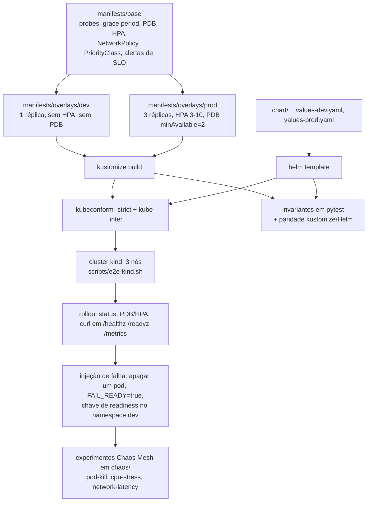

# k8s-sre-lab

Um deploy Kubernetes de um único serviço que carrega o trabalho de confiabilidade nos próprios manifestos: probes com janela de partida, shutdown gracioso, orçamento de interrupção, autoescala, espalhamento suave, política de rede default-deny e alertas de burn rate ligados a SLO — validado por gates de schema e política e por um E2E real em kind dentro do CI.

[](https://github.com/dayxus/k8s-sre-lab/actions/workflows/ci.yml)
[](LICENSE)
[](pyproject.toml)
[](tools/versions.env)

## O que ele faz

- Roda uma API de demonstração sem dependências externas (`app/server.py`, biblioteca padrão do Python) que responde `/healthz`, `/readyz` e `/metrics` no formato de texto do Prometheus, e drena as requisições em andamento ao receber `SIGTERM`.
- Entrega o mesmo contrato de confiabilidade duas vezes: como base kustomize com os overlays `dev` e `prod`, e como chart Helm equivalente (`chart/`) com `values-dev.yaml` / `values-prod.yaml`.
- Afirma o contrato em 160 testes pytest: cada contêiner tem probes de startup, readiness e liveness com requests e limits de cpu/memória, `terminationGracePeriodSeconds: 45` com `preStop` que cabe dentro desse prazo, `maxUnavailable: 0`, PodDisruptionBudget em qualquer workload com mais de uma réplica, security context non-root, tag de imagem fixa, e nada de `hostPath`/`privileged`/`cluster-admin`.
- Compara os dois caminhos de entrega campo a campo (`tests/test_chart.py`): se o `helm template` se afastar do overlay em algum campo que carrega semântica de confiabilidade, a suíte falha.
- Roda kubeconform (`-strict`, contra a versão fixada do Kubernetes) e kube-linter em `scripts/validate.sh`, e prova o overlay de produção renderizado num cluster kind de 3 nós no job `e2e-kind` do CI.
- Registra três experimentos de Chaos Mesh (matar pod, estresse de CPU, latência de rede) com hipótese, sinal, critério de sucesso e rollback em `chaos/`.

## Por que isso importa para SRE

A parte interessante de um deploy não é ele subir: é o que acontece durante o minuto em que ele está rolando, no segundo em que um nó é drenado e no momento em que uma dependência fica lenta. As probes decidem quais pods recebem tráfego, o `preStop` somado ao grace period decide se um pod reiniciado derruba requisição, o PDB e o `maxUnavailable: 0` decidem se um drain e um rollout podem tirar capacidade ao mesmo tempo, e as regras de burn rate decidem se uma degradação lenta é percebida antes de o error budget acabar. Este repositório transforma cada uma dessas decisões em um arquivo que um revisor consegue ler e em um teste que falha quando ela regride — o que um SRE revisa num runbook, sem a prosa.

## O contrato de confiabilidade

| Padrão de confiabilidade | Problema que ele previne | Onde está no repositório |
| --- | --- | --- |
| `startupProbe` em `/healthz` (15 × 2s) | Partida lenta ser lida como travamento, reiniciando o pod em loop | `manifests/base/deployment.yaml` |
| `readinessProbe` em `/readyz` (período de 5s) | Tráfego chegar a um pod que ainda está aquecendo | `manifests/base/deployment.yaml` |
| `livenessProbe` em `/healthz` (período de 10s) | Um processo travado mantendo o endpoint para sempre | `manifests/base/deployment.yaml` |
| `preStop` com sleep + `terminationGracePeriodSeconds: 45` | `SIGTERM` chegar antes de o endpoint sair da rotação, e o cliente ver reset | `manifests/base/deployment.yaml` |
| `strategy.rollingUpdate.maxUnavailable: 0` | Um rollout que tira capacidade antes de a réplica nova estar Ready | `manifests/base/deployment.yaml` |
| `PodDisruptionBudget` `minAvailable: 2` + `unhealthyPodEvictionPolicy: AlwaysAllow` | Um drain de nó derrubar o serviço inteiro, ou um drain travar para sempre por causa de um pod quebrado | `manifests/base/pdb.yaml`, `manifests/overlays/prod/patch-pdb.yaml` |
| HPA 3 → 10, `scaleDown.stabilizationWindowSeconds: 600`, políticas explícitas | Réplicas oscilando por causa de um pico curto | `manifests/base/hpa.yaml` |
| `topologySpreadConstraints` suave + anti-afinidade *preferred* | Todas as réplicas caírem num nó só; ou pods presos em `Pending` quando o cluster tem menos nós que réplicas | `manifests/base/topology-spread.yaml` |
| `NetworkPolicy` default-deny com egress de DNS liberado | Movimento lateral a partir de um pod comprometido | `manifests/base/networkpolicy.yaml` |
| `PriorityClass` `k8s-sre-lab-critical` | A API ser a primeira a sofrer eviction sob pressão de nó | `manifests/base/priorityclass.yaml` |
| `PrometheusRule`: burn rate rápida/lenta + sem-endpoints-prontos, crash-loop, rollout preso | Degradação silenciosa e rollout que nunca termina | `manifests/base/prometheusrule.yaml` |
| Pod non-root, `readOnlyRootFilesystem`, capabilities removidas, seccomp `RuntimeDefault` | Um contêiner que transforma um bug em incidente de nó | `manifests/base/deployment.yaml`, `chart/values.yaml` |

## Arquitetura



## Início rápido

```bash
git clone https://github.com/dayxus/k8s-sre-lab
cd k8s-sre-lab

# Suíte Python + os binários de validação fixados (kustomize, kubeconform, kube-linter, helm em .tools/)
make setup
make test        # 160 testes: invariantes dos manifestos, paridade do chart, comportamento da app, higiene do repo
make validate    # kustomize build + helm lint/template + kubeconform + kube-linter
make check       # lint + test + validate, o gate local completo

# Renderizar os três formatos sem nada instalado no PATH
python3 scripts/render.py --out build

# O caminho de cluster (precisa de docker, kind e kubectl; é o que o job e2e-kind roda)
make e2e
```

## Verifique você mesmo

O overlay de produção renderizado é o objeto que chega ao cluster, então a verificação começa por ele:

```console
$ .tools/kustomize build manifests/overlays/prod | grep -E 'maxUnavailable|maxSurge|minAvailable|terminationGracePeriodSeconds'
      maxSurge: 1
      maxUnavailable: 0
      terminationGracePeriodSeconds: 45
  minAvailable: 2

$ .tools/kube-linter lint --config .kube-linter.yaml build/kustomize-prod.yaml build/helm-prod.yaml
KubeLinter 0.8.3

No lint errors found!
```

O `make check` roda o mesmo gate nos dois caminhos de entrega: o `kubeconform -strict` precisa baixar
os schemas da versão fixada do Kubernetes e o E2E em kind precisa de um runtime de contêiner —
nenhum dos dois existe na máquina onde este repositório foi escrito, por isso a execução
autoritativa do `scripts/e2e-kind.sh` é o job `e2e-kind` do workflow de CI.

## Manutenção automatizada

O `maintenance.yml` roda toda segunda-feira às 06:17 UTC (e sob demanda via `workflow_dispatch`). Ele consulta `dl.k8s.io/release/stable.txt` e a API de releases do GitHub para saber as versões estáveis atuais de Kubernetes, kind, kustomize, kubeconform, kube-linter, Helm e shellcheck, atualiza os pinos em `tools/versions.env` quando eles mudaram, regenera o `docs/versions.md` a partir dessa única fonte de verdade e reexecuta o gate inteiro: `scripts/validate.sh` (incluindo kubeconform contra a versão mais nova do Kubernetes, que é como deprecações de `apps/v1` aparecem antes de virar incidente) mais `scripts/audit.py`. A auditoria grava `reports/weekly-audit.md` com a tabela de versões, o resultado de schema/política e a contagem de violações por invariante. O `scripts/maintenance.sh` só commita quando o `git diff --quiet` mostra mudança real, e qualquer falha de validação abre uma issue com a saída literal das ferramentas em vez de commitar um bump quebrado.

## Estrutura do projeto

```
app/                     API demo (stdlib) + Dockerfile: non-root, HEALTHCHECK, sem dependência externa
manifests/base/          base kustomize: namespace, deployment, service, configmap, pdb, hpa,
                         priorityclass, networkpolicy, servicemonitor, prometheusrule,
                         topology-spread
manifests/overlays/dev/  1 réplica, recursos pequenos, sem HPA, sem PDB
manifests/overlays/prod/ 3 réplicas, requests/limits reais, HPA 3-10, PDB minAvailable=2
chart/                   chart Helm que precisa reproduzir o mesmo contrato (values-dev, values-prod)
chaos/                   experimentos Chaos Mesh + hipótese, sinal e rollback por escrito
scripts/                 install-tools, render, validate, e2e-kind, audit, update_versions, maintenance
tests/                   pytest: invariantes dos manifestos, paridade do chart, app, higiene do repo
docs/                    reliability-patterns.md, chaos-experiments.md, versions.md (gerado)
tools/versions.env       todas as versões fixadas usadas pelos scripts e pelo CI
.github/workflows/       ci.yml (lint, manifests, e2e-kind) e maintenance.yml (semanal)
Makefile                 setup, test, lint, validate, render, audit, check, e2e, clean
```

## Limitações e próximos passos

- Um serviço só, sem camada de dados: o laboratório demonstra o contrato, não um sistema distribuído. Nada aqui exercita timeouts ou retries entre serviços.
- Os experimentos de caos são declarativos e revisados, não executados pelo CI. Apenas os caminhos de falha em runtime (`FAIL_READY=true`, a chave de readiness no namespace dev) são exercitados no E2E em kind; os três arquivos de Chaos Mesh precisam de um operador que o runner não instala, então eles documentam hipótese e rollback em vez de rodar.
- Os alertas de burn rate são calculados ao longo de horas de tráfego real. O laboratório entrega as regras e um endpoint `/metrics` que emite as séries, mas o cluster kind vive minutos, então o corpo das regras é coberto por testes, não por um alerta disparando.
- Falha de nó está fora de escopo: toda injeção de falha acontece no nível do pod, num cluster kind de um único node group. Perda real de nó (heartbeat do kubelet, eviction, detach de volume) precisa de outro arranjo.
- O teste de paridade kustomize/Helm compara os campos que carregam semântica de confiabilidade; os nomes dos objetos diferem por construção (o Helm prefixa o nome da release), então não se deve esperar saída idêntica byte a byte.
- Próximos passos: um dashboard Grafana provisionado a partir das mesmas recording rules, um `VerticalPodAutoscaler` em modo de recomendação no overlay dev, e um experimento de caos por noite contra um cluster efêmero, para que os arquivos de experimento sejam executados em algum lugar além de um laptop.

---

English: [README.md](README.md)

Parte do [portfólio SRE dayxus](https://github.com/dayxus).
